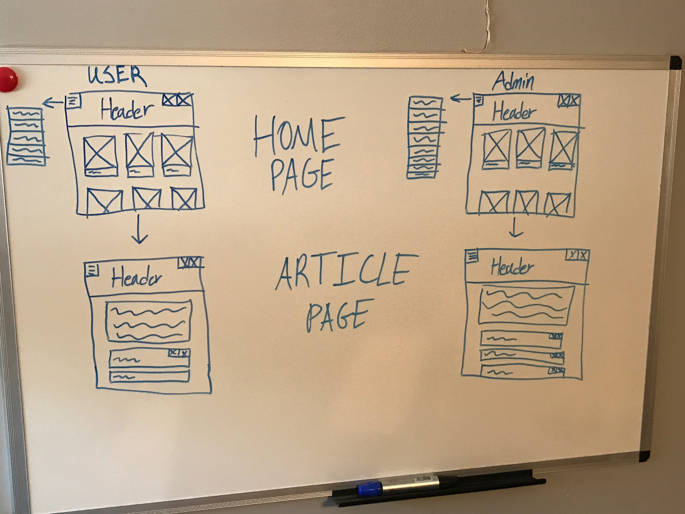
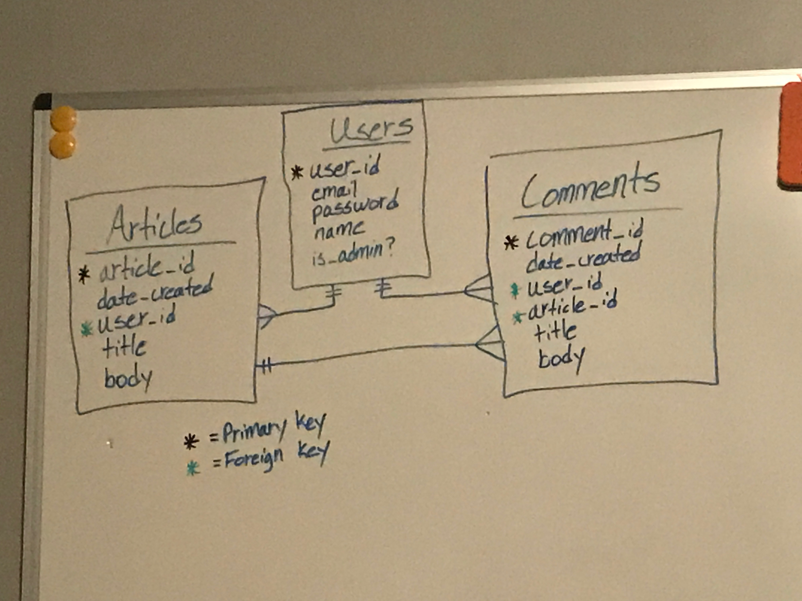

# Wireframe:

# ERD Diagram:

# User Stories:
###### Items with '*' are reach goals

- When users enter the website, users should see the landing page with a list of available articles
- When users sign-up, users should see an indication of its success or failure.
- When users sign-in, users should see an indication of its success or failure.
  - Once signed in, users should be able to change my password or sign-out.
  - *If users forgot my password, users should see a link that will allow me to reset my password.
- When users click on an article, users should be brought to a new page with the article.
  - On that page, users should see a navigation bar that will allow me to return to the home page.
  - Users should be able to comment on the article that they are viewing and delete/edit their previous comments.
  - Users with administrator privileges should be able to delete any comment on the article.
- When users click the menu icon, users should see account options.
  - Users should be able to see their recent comment history.
  - *Users should be able to submit their articles for administrator approval.
  - *Users should be able to see their friends.
    - *Users should be able to message their friends.
  -Users with administrator privileges should be able to post articles to the website.
  -*Users with administrator privileges should be able to restrict user accounts.
