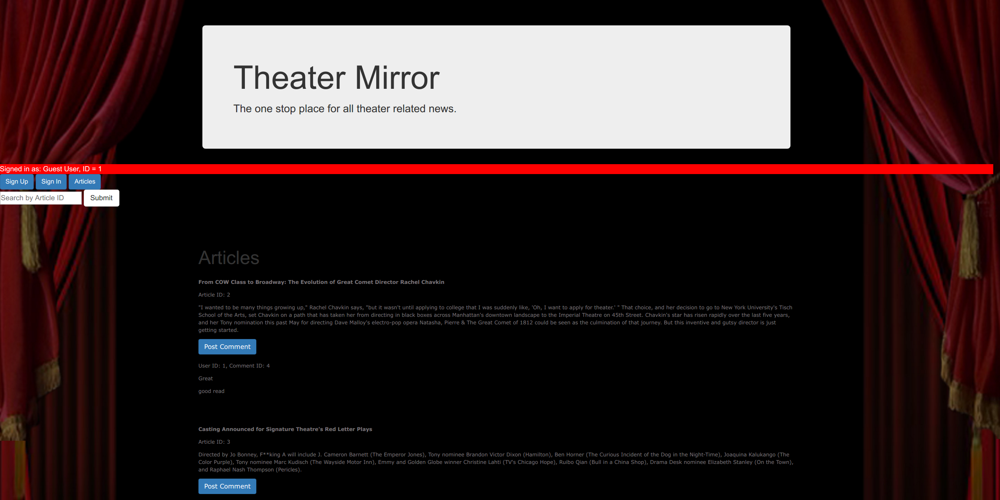

# TheaterMirror
### By Sam Dyer
#### In Association With General Assembly

Link to hosted application:
[TheaterMirror By Sam Dyer](https://slammyde7113.github.io/theater-mirror-front-end/)

### Landing Page:

Link to back-end api:
[Rails Api](https://github.com/slammyde7113/theater-mirror-back-end)

# Wireframe:

# ERD Diagram:

# Technologies Used:
-   [Webpack](https://webpack.github.io)
-   [Bootstrap](http://getbootstrap.com)
-   [Handlebars.js](http://handlebarsjs.com)
-   [Grunt](https://gruntjs.com/)
-   [Rails](http://rubyonrails.org/)

# Project History:

### Description
TheaterMirror is a online blog dedicated to reviewing theater plays, books, and movies. It was built to replace the another website that serves a similiar function. On TheaterMirror, visitors of the site can read articles, members can read and post articles, and the administrator can post articles, make comments, and read articles.

### Work Flow Breakdown
This project consisted of two phases

    1.) Backend Development
    2.) Frontend development

  In the backend development phase, research was done to implement specific Ruby gems, such as [CanCan](https://rubygems.org/gems/cancan/versions/1.6.10) and [Paperclip](https://rubygems.org/gems/paperclip/versions/4.3.6). Initially, CanCan was going to be used for authentication, however a much simpler work around was incorporated through the GA Rails template. Paperclip will be incorporated at a later date to facilitate uploads, but the multi-role authentication (guest, member, and admin) took priority.
   Frontend development was straight forward, using Ajax to communicate with Rails, and jQuery to manipulate the DOM. Handlebars was used to dynamically bind elements retrieved from the backend to elements in the DOM and HTML5/CSS was used to display them. Styling was done primarily with Bootstrap.

# Unsolved Problems:

- Edit/Delete Comments should be in the same div as the comments populating the page.
- The Actions dropdown menu can only be accessed by tabbing through the input fields. Dropdown
    menu should remained open until the user enters the submit action.
- Paperclip gem is need to upload images.
- Search bar should be updated to search for titles instead of IDs
- Administrators should be able to delete comments regardless of who posted them. At the moment,
    only the user who posted the comment may edit/delete their comment.

# User Stories:
###### Items with '*' are reach goals

- When users enter the website, users should see the landing page with a list of available articles
- When users sign-up, users should see an indication of its success or failure.
- When users sign-in, users should see an indication of its success or failure.
  - Once signed in, users should be able to change my password or sign-out.
  - *If users forgot my password, users should see a link that will allow me to reset my password.
- When users click on an article, users should be brought to a new page with the article.
  - On that page, users should see a navigation bar that will allow me to return to the home page.
  - Users should be able to comment on the article that they are viewing and delete/edit their previous comments.
  - Users with administrator privileges should be able to delete any comment on the article.
- When users click the menu icon, users should see account options.
  - Users should be able to see their recent comment history.
  - *Users should be able to submit their articles for administrator approval.
  - *Users should be able to see their friends.
    - *Users should be able to message their friends.
  -Users with administrator privileges should be able to post articles to the website.
  -*Users with administrator privileges should be able to restrict user accounts.
